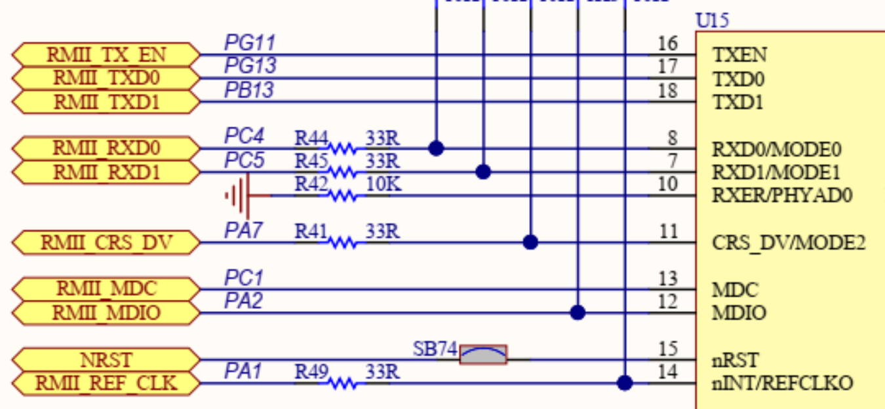
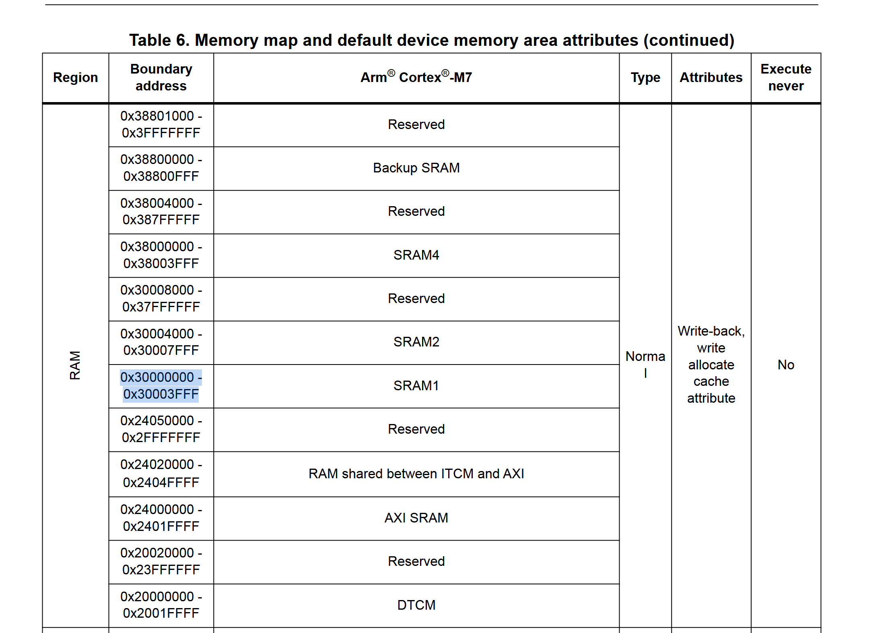
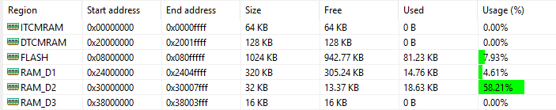

# Purpose
-  During my internship, I was assigned a task to set up an SNTP server on a board. As an intern, I was primarily responsible for the high-level setup — getting LwIP and SNTP running on the board. However, I wasn’t satisfied with just getting it to work superficially. I wanted a deeper understanding of how it all functioned, so I challenged myself to start from scratch.
- This documentation serves as a development log of my journey researching how to get Ethernet working on an STM32 board — specifically the STM32H723ZG — from scratch, as a beginner learning STM32 development.
- Feel free to use this documentation as a point of reference for your own development.

# Development Tools
- STM32CubeIDE

# Development Log

### Setting Up Ethernet on the STM32H723ZG

My first approach was to research how others have set up Ethernet on STM32 boards. I came across [this post](https://community.st.com/t5/stm32-mcus/how-to-create-a-project-for-stm32h7-with-ethernet-and-lwip-stack/ta-p/49308) about setting up LwIP on STM32H7. Since the STM32H723ZG was mentioned, I decided to buy the board. After receiving it, I followed the tutorial exactly — but the result was not what I expected.

> I later realized that one of the reason might also be that I connected the board's Ethernet port to a router, then connected the router to a computer. I later discovered this setup may have been the cause of my initial failure.

At this point, I still didn’t understand why certain steps — such as setting up the MPU on the Cortex-M7 — were necessary. Over the next week, I spent more time analyzing other people’s code, but the result remained the same: I couldn’t get Ethernet working properly on the board.

On the bright side, I learned a lot more about Ethernet. For example, I discovered that there are different interface modes: MII (Media Independent Interface) and RMII (Reduced Media Independent Interface). While reviewing the STM32H723ZG schematic, I noticed something important: **the pin configuration shown in the schematic didn’t match what STM32CubeIDE generated**.



STM32CubeIDE came close to generating the correct configuration, but in this case, **RMII_TXD1** should be on **PB13**, not **PG12** as shown in the generated code. I facepalmed — I should’ve checked the schematic earlier. As someone with no background in electrical engineering, I used to be intimidated by schematics and symbols. But now I realize they’re incredibly useful.

I updated the GPIO configuration in STM32CubeIDE and regenerated the code. It compiled successfully and I flashed it to the board. But once again, when I tried to ping the board from my computer, I only saw **Request Timed Out**.

I continued researching how others solved this. One thing I noticed is that **different boards use different memory addresses when configuring the MPU**. For example, in the earlier ST post, the MPU address is set to `0x30020000`, and `DMARxDscrTab` is placed at `0x30000000`.

I also found [this YouTube video](https://www.youtube.com/watch?v=8r8w6mgSn1A&list=PLfIJKC1ud8gjoY2McCCqkxXWuwiC2iSap&index=9), which helped me realize that **MPU memory configurations vary across boards**, and you need to refer to the board’s reference manual. The video author used an address from **SRAM1**, so I looked up the SRAM1 address for my board — which turned out to be `0x30000000` — and updated my configuration accordingly.



This proved to be useful, and I was finally able to see that the build was flashing to **RAM_D2**, as shown in the video.



I was highly confident that the code would work this time, but life proved me wrong once again. But there is some positive sign, first I add some simple debugging printing statement and see that the Ethernet link is up. This mean that the board know the Ethernet is connected. Further debugging show that the code get stuch in a infinite while loop called HardFault_Handler(). I used [this article](https://community.st.com/t5/stm32-mcus/how-to-debug-a-hardfault-on-an-arm-cortex-m-stm32/ta-p/672235#:~:text=6.-,Debugging%20the%20HardFault,instruction%20that%20caused%20the%20HardFault.) as a reference to solve the issue
```
/**
  * @brief This function handles Hard fault interrupt.
  */
void HardFault_Handler(void)
{
  /* USER CODE BEGIN HardFault_IRQn 0 */
	printf("Enter HardFault_Handler\n");

  /* USER CODE END HardFault_IRQn 0 */
  while (1)
  {
    /* USER CODE BEGIN W1_HardFault_IRQn 0 */
    /* USER CODE END W1_HardFault_IRQn 0 */
  }
}
```

After this, I decided to do a little bit of research on the MPU in the CM7 through [this video](https://www.youtube.com/watch?v=2q8IvCxSjaY&list=PLfIJKC1ud8gjoY2McCCqkxXWuwiC2iSap&index=5). As far as I know, this is a feature available on the chip that prevents unwanted access to specific regions of memory: write, read, and fetch. In the configuration, you can set the region to be shareable, cacheable, bufferable, or execute-never. Shareable refers to the ability for memory to be accessed by multiple masters. Cacheable allows the region to be cached. Bufferable means that writes to memory can be buffered and written later. Execute-never means that the region is not allowed to execute code.

Using this knowledge, I changed the MPU configuration to be shareable only for the `0x30000000` region, and I was finally able to ping the board.
